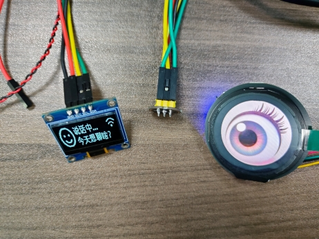

# 🤖 Xiaozhi AI - 串口屏拟人化“眼睛”增强版
**(Xiaozhi AI with Serial Screen Eye Animation)**

> **基于 [小智 AI (Xiaozhi ESP32)](https://github.com/78/xiaozhi-esp32) 源码深度改造，为 AI 助手注入“灵魂”。**

本项目在原版小智的基础上，增加了一块圆形串口屏作为“眼睛”。它不仅能根据 AI 的聆听、思考、说话状态实时切换生动的眼神动画，还支持“慵懒/精神”双模式切换，并可通过语音指令（MCP）直接控制眼睛的开合。

---

## ✨ 效果演示 (Demo)

<!-- 请在这里替换你的实际图片或 GIF 链接 -->
<div align="center">
  
  
</div>

---

## 🚀 新增核心功能 (Key Features)

1.  **👀 全状态拟人动画**：
    *   **空闲模式 (Idle)**：进入“慵懒模式”，眼睛半眯（Lazy Frames），呼吸节奏缓慢，偶尔进行微幅眨眼，模拟打瞌睡的状态。
    *   **聆听模式 (Listening)**：瞬间唤醒，“瞪大眼睛”（Active Frames），眼神专注，伴随快速双眨眼确认。
    *   **说话模式 (Speaking)**：配合语音输出，眼神活跃跳动。
    *   **强制闭眼**：通过语音指令强制闭眼，且在后台屏蔽随机动画。

2.  **🗣️ 实时字幕显示**：
    *   将大模型的回复实时同步显示在串口屏下方。
    *   **智能转码**：内置 `UTF-8` 转 `GB2312` 算法，完美解决国产串口屏中文乱码问题。
    *   **格式清洗**：自动过滤特殊符号（如英文双引号），防止串口指令截断。

3.  **🔌 MCP 语音控制**：
    *   新增 `Eye_Controller` 工具。
    *   支持语音指令：“把眼睛闭上”、“睁开眼睛”。

4.  **⚡ 独立动画引擎**：
    *   基于 **FreeRTOS Task** 的独立动画线程，不阻塞主逻辑（Wi-Fi、音频处理）。
    *   支持随机眨眼间隔、眼球微颤 (Micro-saccades)，拒绝死板的循环播放。

---

## 🛠️ 代码修改详解 (Modifications)

本项目主要在 `main` 目录下进行了以下增量修改：

### 1. 新增文件 (New Files)

| 文件名 | 作用描述 |
| :--- | :--- |
| **`main\screen_driver.h/cc`** | **串口屏底层驱动**。<br>- 封装 UART 发送指令。<br>- 处理 UTF-8 转 GBK 编码。<br>- 提供 `SendSubtitle` 和 `SendCommand` 接口。 |
| **`main\eye_animator.h/cc`** | **动画逻辑引擎 (The Brain)**。<br>- 运行一个独立的 FreeRTOS 任务。<br>- 管理素材池：区分“慵懒组”(ID 42-45) 和 “精神组”。<br>- 算法生成随机眨眼、随机微动，处理状态机切换逻辑。 |
| **`main\utf8togb2312.c/h`** | **字符编码转换库**。<br>- 提供 Unicode 到 GBK 的映射表，确保中文字幕在屏幕上正常显示。 |
| **`bread-compact-wifi\Eye_Control.h`** | **添加MCP控制眼睛指令**。<br>- 添加MCP控制眼睛指令，能够实现语音互动的动画效果。 |

### 2. 修改文件 (Modified Files)

| 文件名 | 修改位置 | 修改内容与目的 |
| :--- | :--- | :--- |
| **`main\application.cc`** | `HandleStateChangedEvent` | **状态钩子**。在设备状态切换（Idle/Listening/Speaking）时，调用 `ScreenDriver::SetEyeState` 通知动画引擎切换模式。 |
| **`main\application.cc`** | `HandleProtocolMessage` | **字幕钩子**。在解析到 LLM 返回的 JSON 文本时，调用 `ScreenDriver::SendSubtitle` 将文字同步发送给屏幕。 |
| **`bread-compact-wifi\compact_wifi_board.cc`** | `InitializeTools` | **注册 MCP 工具**。实例化 `Eye_Controller`，使大模型能够通过 Function Call 调用眼睛控制函数。 |
| **`main\CMakeLists.txt`** | `SRCS` 列表 | 将上述新增的 `.c/.cc` 文件加入编译路径。 |

---

## ⚙️ 硬件与资源配置 (Hardware & Config)

### 1. 硬件连接
*   **MCU**: ESP32-S3 (N16R8 推荐)
*   **屏幕**: 圆形串口屏 (深圳市尚视界公司，支持图片指令 `FSIMG` 或类似)
*   **接线**:
    *   ESP32 TX (GPIO 9) -> 屏幕 RX
    *   ESP32 RX (GPIO 10) -> 屏幕 TX
    *   **GND <-> GND** (必须共地！)
    *   VCC -> 5V (建议独立供电或接 USB 5V，勿用 ESP32 3.3V)

### 2. 屏幕资源映射 (Image Mapping)
代码中使用了 `FSIMG` 指令显示全屏图片，图片存储在屏幕 Flash 中。代码中的地址映射逻辑如下（需根据你的屏幕工程调整）：

*   **基地址**: `2212352` (第 0 张图的地址)
*   **地址偏移**: `80000` (每张图的大小)
*   **计算公式**: `Address = 2212352 + (ID * 80000)`

**关键图片 ID 定义**:
*   `ID 0 - 59`: 全套素材。
*   `ID 42 - 45`: **慵懒/半眯眼序列** (用于 Idle 模式)。
*   `ID 6-11, 20-25, 31-36`: **完整眨眼序列** (用于 Active 模式)。

---

## 💻 核心逻辑解析 (Core Logic)

### 动画引擎 (EyeAnimator)
为了实现“生物感”，我们没有使用简单的定时器，而是设计了一个基于概率的行为树：

```cpp
void AnimationTask() {
    while(true) {
        if (强制闭眼) { 显示闭眼图; continue; }
        
        if (唤醒瞬间) { 播放快速双眨眼; }
        
        if (到了眨眼时间) {
            if (当前是慵懒模式) 播放缓慢的半睁眼动画;
            else 播放利落的全幅眨眼动画;
            重置下次眨眼时间(随机 2s~6s);
        }
        
        // 微动逻辑
        if (当前是慵懒模式) 在 42-43 帧之间缓慢切换;
        else 在所有睁眼帧之间切换;
        
        vTaskDelay(随机时间);
    }
}
```

---

## ⚠️ 注意事项 (Notes)

1.  **引脚冲突**：请务必检查 `sdkconfig`，确保 UART 使用的 GPIO (如 9/10) 没有被 I2S 麦克风或 SD 卡占用。
2.  **供电不足**：串口屏启动瞬间电流较大，如果 ESP32 无限重启，请检查供电。
3.  **中文字库**：请确保串口屏工程中已包含中文字库，且文本控件 `txt_maxl` 属性设置足够大（建议 500+），否则长回复会被截断。

---

## 👏 致谢 (Credits)

*   感谢 [Xiaozhi AI](https://github.com/78/xiaozhi-esp32) 提供的出色开源框架。
*   感谢开源社区 [utf2gbk](https://gitee.com/gongcm/utf2gbk) 提供的 UTF8-GBK 转码表。

---

> **Author**: [FHB/ajhdkjsahd]
> **Date**: 2026
